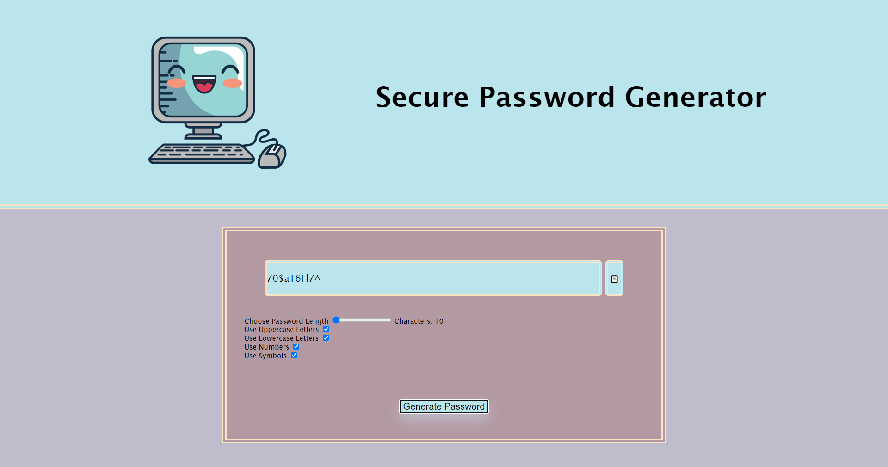
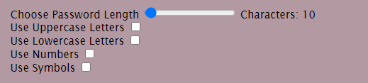
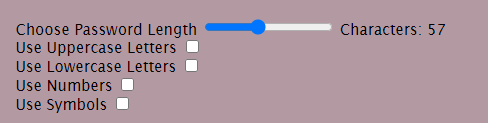
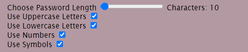
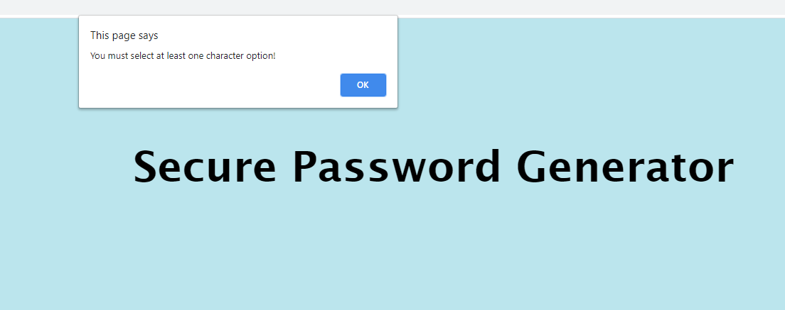
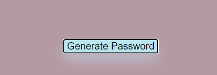
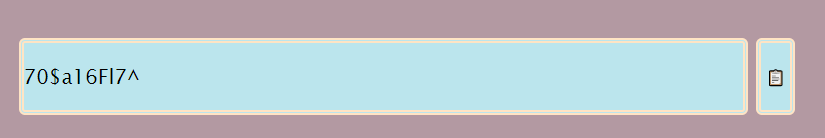
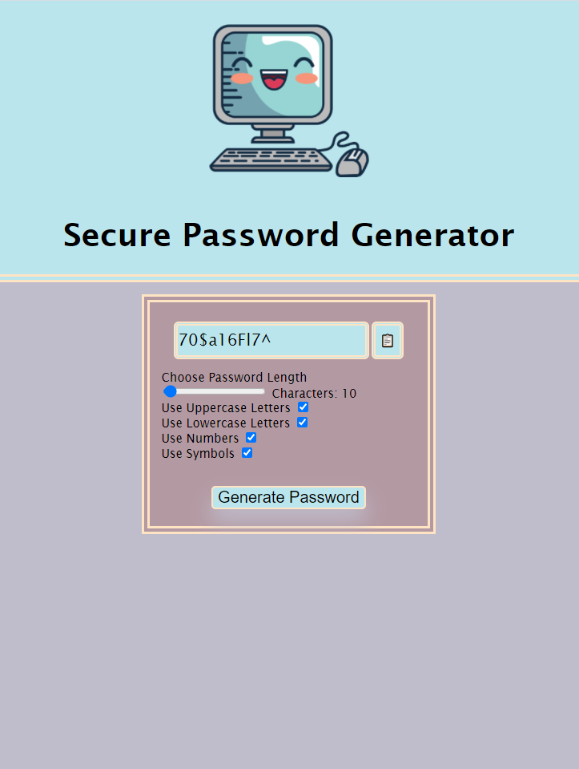

# Password Generator

## About
This project is designed to gnereate a password with a minimum of 8 characters and a maximum of 128 characters. Characters used to generate a password are uppercase letters, lowercase letters, numbers, and symbols. Once a user generates a password they have the capability to copy it to their clipboard.

## User Instructions
The site can be accessed at:  https://scashmore.github.io/Password_Generator/

In order to generate a passwer, the user must select at least one of the four character options and move the slider to the desiered position for length.

Failure to selesct a character option will result in an alert telling the user that they must select a character option. 

Once selections have been made the user clicks the generate password button. 

A password should be generated, and the user can click the clipboard icon to copy the password to their clipboard.

If the user desires to create another password, simply click the generate password button again.

Note this project also funtions on vdevices of various screen size.

## Credit
kawaiiComputer.jpg: https://www.clipartmax.com/download/m2H7m2K9G6G6m2i8_kawaii-desktop-computer-icon-kawaii-computer/

reset.css: http://meyerweb.com/eric/tools/css/reset/  (public domian) 
